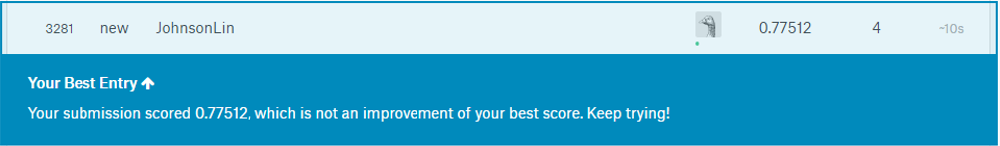

#讀入資料#
```{r}
titanic <- read.csv("https://storage.googleapis.com/r_rookies/kaggle_titanic_train.csv")
```


#資料框外觀與描述性統計#
利用 `dim()` 函數可以得知該 dataset 有 891 個觀測值，12 個變數。
```{r}
dim(titanic)
```

使用 `summary()` 函數能獲得更詳細之描述性統計資料。
```{r}
summary(titanic)
```


#資料清裡#
由 summary 結果可以看出，變數 `Age` 共有 177 遺漏值，用 `complete.cases()` 函數去除。
```{r}
titanic <- titanic[complete.cases(titanic), ]
```

另外，變數 `Embarked` 有兩個空值，以 S 填補。
```{r}
titanic$Embarked <- as.character(titanic$Embarked)
titanic$Embarked[titanic$Embarked == ""] <- "S"
titanic$Embarked <- factor(titanic$Embarked)
```


#建立一個分類模型#
以 `randomForest()` 函數建立隨機森林分類模型來進行 `Survived` 變數預測。
```{r warning = FALSE}
# install.packages(randomForest)
# 預先開啟 randomForest 並更改 Survived 變數之型別
titanic$Survived <- factor(titanic$Survived)
library(randomForest)

# 利用 for loop 建立 accuracy > 0.97 之模型
#for (i in 1:10^5) {
#  # 切分訓練資料與測試資料
#  set.seed(i)
#  n <- nrow(titanic)
#  random_titanic <- titanic[sample(n),]
#  train_indices <- 1:round(0.85 * n)
#  train <- titanic[train_indices, ]
#  test_indices <- round(0.85 * n) + 1:n
#  test <- titanic[test_indices, ]
  
  # 建立模型
#  classifier <- randomForest(Survived)
  
#  # 計算 accuracy
#  prediction <- predict(classifier, test[ ,c("Pclass", "Sex", "Age", "SibSp", "Parch", "Fare", "Embarked")])
#  confusion_matrix <- table(test$Survived, prediction)
#  accuracy <- sum(diag(confusion_matrix)) / sum(confusion_matrix)
#  
#  if (accuracy > 0.97) {
#    break
#  }
#}

# 由上述 for loop 獲得 set.seed(40) 時能得到 accuracy > 0.95，以下為正式的模型建立。
# 切分訓練資料與測試資料
set.seed(23)
n <- nrow(titanic) 
random_titanic <- titanic[sample(n), ]
train_indices <- 1:round(0.85 * n)
train <- random_titanic[train_indices, ]
test_indices <- (round(0.85 * n) + 1):n
test <- random_titanic[test_indices, ]

# 建立模型
library(randomForest)
titanic$Survived <- factor(titanic$Survived)
classifier <- randomForest(Survived ~ Pclass + Sex + Age + SibSp + Parch + Fare + Embarked, data = titanic, ntree = 10000)

# 計算 accuracy
prediction <- predict(classifier, test[, c("Pclass", "Sex", "Age", "SibSp", "Parch", "Fare", "Embarked")])
confusion_matrix <- table(test$Survived, prediction)
accuracy <- sum(diag(confusion_matrix)) / sum(confusion_matrix)

paste("accuracy",accuracy, sep = "=")

```


#進行資料預測#
###要求: 不可以刪除預測值###

先載入要預測的資料，並用 `summary()` 觀察資料狀況。
```{r}
url <- "https://storage.googleapis.com/py_ds_basic/kaggle_titanic_test.csv"
to_predict <- read.csv(url)
summary(to_predict)
```

可知 `Age` 有 86 個遺漏值，`Fare` 有 1 個遺漏值。進行遺漏值填補。
```{r message = FALSE}
library(dplyr)
library(magrittr)

# Fare 用平均值填上
to_predict$Fare[is.na(to_predict$Fare)] <- mean(to_predict$Fare, na.rm = TRUE)

# Age 依照 Pclass 的平均年齡填滿
mean_age_by_Pclass <- to_predict %>%
  group_by(Pclass) %>%
  summarise(mean_age = round(mean(Age, na.rm = TRUE)))
mean_age_by_Pclass
```
```{r}
filter_1 <- is.na(to_predict$Age) & to_predict$Pclass == 1
filter_2 <- is.na(to_predict$Age) & to_predict$Pclass == 2
filter_3 <- is.na(to_predict$Age) & to_predict$Pclass == 3
to_predict[filter_1, ]$Age <- 41
to_predict[filter_2, ]$Age <- 29
to_predict[filter_3, ]$Age <- 24
```

填補完成後，進行資料預測並輸出檔案
```{r}
predicted <- predict(classifier, newdata = to_predict[, c("Pclass", "Sex", "Age", "SibSp", "Parch", "Fare", "Embarked")])
to_submit <- data.frame(to_predict[, "PassengerId"], predicted)
names(to_submit) <- c("PassengerId", "Survived")
head(to_submit, n = 10)
write.csv(to_submit, file = "to_submit.csv", row.names = FALSE)
```

最後上傳結果
